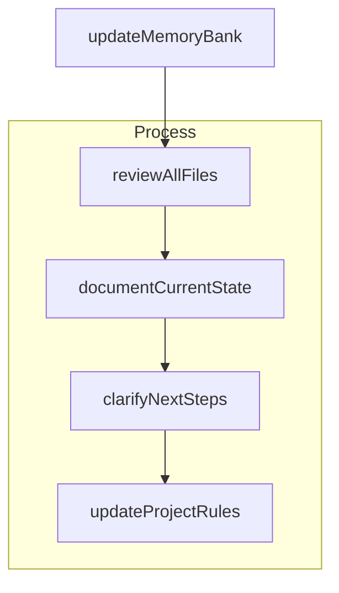

# Workflow: Atualização de Documentação / Memory Bank

```mermaid
flowchart TD
    Start[updateMemoryBank] --> P1[reviewAllFiles]

    subgraph Process
        P1 --> P2[documentCurrentState]
        P2 --> P3[clarifyNextSteps]
        P3 --> P4[updateProjectRules]
    end
```
