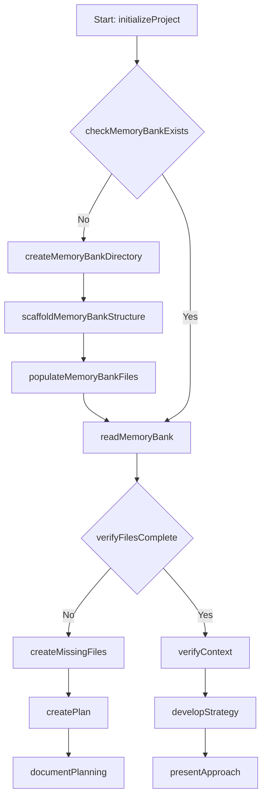

# Workflow: Plan Mode

Objetivo: entender o problema, o contexto e produzir um plano sólido antes de escrever código.

Etapas principais:
- Inicializar projeto, verificar/ criar Memory Bank.
- Ler contexto de todos os arquivos relevantes.
- Analisar problema (`analyzeProblem`).
- Criar plano (`createPlan`).
- Documentar plano em `.windsurf/plans/`.
- Desenvolver estratégia e apresentá-la ao usuário.
