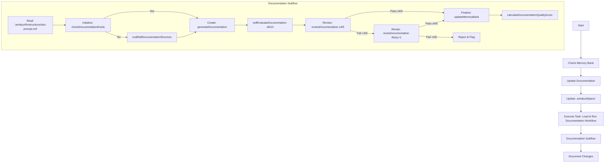

# Workflow: Specification Documentation Mode

Este modo é usado para criação/atualização de documentação formal (especificações, planos, etc.).

```mermaid
flowchart TD
Start[Start] --> Context[Check Memory Bank]
Context --> Update[Update Documentation]
Update --> Rules[Update .windsurf/plans/]
Rules --> Execute[Execute Task: Load & Run Documentation Workflow]
Execute --> Subflow[Documentation Subflow]
Subflow --> Document[Document Changes]

subgraph Documentation Subflow
    Load[Read '.windsurf/instructions/doc-prompt.md'] --> Init[Initialize: checkDocumentationExists]
    Init -->|No| Scaffold[scaffoldDocumentationStructure]
    Init -->|Yes| Create[Create: generateDocumentation]
    Scaffold --> Create
    Create --> SelfEval[selfEvaluateDocumentation ≥8/10]
    SelfEval --> Review[Review: reviewDocumentation ≥4/5]
    Review -->|Pass ≥4/5| Finalize[Finalize: updateMemoryBank]
    Review -->|Fail <4/5| Revise[Revise: reviseDocumentation Retry=1]
    Revise -->|Pass ≥4/5| Finalize
    Revise -->|Fail <4/5| Reject[Reject & Flag]
    Finalize --> Score[calculateDocumentationQualityScore]
end
```
